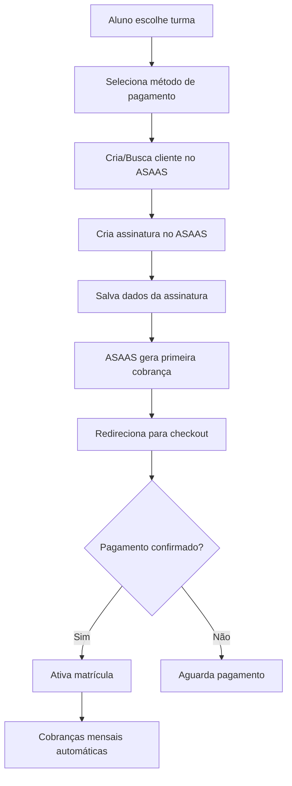

# Plano de Integração ASAAS com Assinaturas - Vila Dança & Arte

## Visão Geral

Este documento detalha o plano de integração com a plataforma ASAAS usando o modelo de **assinaturas recorrentes** (estilo Netflix) para o sistema de gestão da Vila Dança & Arte. Cada matrícula em uma turma será uma assinatura mensal independente.

## Mudança de Paradigma: De Pagamento Único para Assinatura

### Modelo Anterior (Pagamento Único)
- Taxa de matrícula única
- Pagamentos avulsos mensais
- Gestão manual de cobranças

### Novo Modelo (Assinatura Recorrente)
- **Assinatura por Turma**: Cada turma é uma assinatura separada
- **Cobrança Automática**: Renovação mensal automática
- **Múltiplas Assinaturas**: Aluno pode ter várias assinaturas ativas
- **Flexibilidade**: Pausar, cancelar ou reativar a qualquer momento

## Arquitetura de Assinaturas

### 1. Estrutura de Dados

```sql
-- Nova tabela para controlar assinaturas
CREATE TABLE subscriptions (
  id UUID PRIMARY KEY DEFAULT gen_random_uuid(),
  student_id UUID REFERENCES students(id),
  enrollment_id UUID REFERENCES enrollments(id),
  asaas_subscription_id TEXT UNIQUE,
  asaas_customer_id TEXT,
  status TEXT CHECK (status IN ('active', 'paused', 'cancelled', 'overdue')),
  billing_type TEXT CHECK (billing_type IN ('CREDIT_CARD', 'PIX', 'BOLETO')),
  value DECIMAL(10,2),
  cycle TEXT DEFAULT 'MONTHLY',
  next_due_date DATE,
  created_at TIMESTAMP DEFAULT NOW(),
  updated_at TIMESTAMP DEFAULT NOW(),
  cancelled_at TIMESTAMP,
  paused_at TIMESTAMP,
  reactivated_at TIMESTAMP
);

-- Tabela para histórico de pagamentos da assinatura
CREATE TABLE subscription_payments (
  id UUID PRIMARY KEY DEFAULT gen_random_uuid(),
  subscription_id UUID REFERENCES subscriptions(id),
  asaas_payment_id TEXT UNIQUE,
  amount DECIMAL(10,2),
  due_date DATE,
  paid_date DATE,
  status TEXT,
  payment_method TEXT,
  invoice_url TEXT,
  created_at TIMESTAMP DEFAULT NOW()
);

-- Índices para performance
CREATE INDEX idx_subscriptions_student ON subscriptions(student_id);
CREATE INDEX idx_subscriptions_status ON subscriptions(status);
CREATE INDEX idx_subscription_payments_subscription ON subscription_payments(subscription_id);
```

### 2. Fluxo de Matrícula com Assinatura



## Implementação Detalhada

### Fase 1: Infraestrutura de Assinaturas

#### 1.1 Atualizar Edge Function `create-enrollment-subscription`

```typescript
interface CreateSubscriptionRequest {
  student_id: string;
  enrollment_id: string;
  class_id: string;
  billing_type: 'CREDIT_CARD' | 'PIX' | 'BOLETO';
  customer: {
    name: string;
    email: string;
    cpfCnpj: string;
    phone: string;
  };
  value: number;
  description: string;
}

// Criar assinatura no ASAAS
const subscriptionPayload = {
  customer: asaasCustomer.id,
  billingType: billing_type,
  nextDueDate: getNextDueDate(), // Próximo dia 5 ou 10
  value: classValue,
  cycle: 'MONTHLY',
  description: `Mensalidade - ${className}`,
  externalReference: enrollment_id,
  fine: {
    value: 2.00,
    type: 'PERCENTAGE'
  },
  interest: {
    value: 1.00,
    type: 'PERCENTAGE'
  },
  discount: {
    value: 5.00, // 5% desconto para pagamento antecipado
    dueDateLimitDays: 5
  }
};
```

#### 1.2 Webhook Handler para Assinaturas

```typescript
// Edge Function: asaas-subscription-webhook
const handleSubscriptionWebhook = async (event: WebhookEvent) => {
  switch (event.event) {
    case 'PAYMENT_CREATED':
      // Nova cobrança mensal gerada
      await createSubscriptionPaymentRecord(event.payment);
      break;
      
    case 'PAYMENT_RECEIVED':
      // Pagamento confirmado
      await confirmSubscriptionPayment(event.payment);
      await activateEnrollmentIfFirstPayment(event.payment);
      break;
      
    case 'PAYMENT_OVERDUE':
      // Pagamento vencido
      await handleOverdueSubscription(event.payment);
      await notifyStudentOverdue(event.payment);
      break;
      
    case 'PAYMENT_REFUNDED':
      // Reembolso processado
      await handleRefund(event.payment);
      break;
  }
};
```

### Fase 2: Interface do Aluno

#### 2.1 Componente de Seleção de Turmas

```typescript
// StudentClassSubscription.tsx
const StudentClassSubscription = () => {
  // Mostrar turmas disponíveis
  // Permitir seleção múltipla
  // Calcular valor total das assinaturas
  // Opção de método de pagamento padrão
  
  const handleSubscribe = async (classIds: string[]) => {
    // Criar uma assinatura para cada turma
    const subscriptions = await Promise.all(
      classIds.map(classId => createSubscription(classId))
    );
    
    // Redirecionar para checkout múltiplo ou individual
  };
};
```

#### 2.2 Gerenciamento de Assinaturas

```typescript
// StudentSubscriptions.tsx
const StudentSubscriptions = () => {
  // Listar todas as assinaturas ativas
  // Opções: Pausar, Cancelar, Alterar pagamento
  // Histórico de pagamentos
  // Próximas cobranças
  
  return (
    <div>
      {subscriptions.map(sub => (
        <SubscriptionCard
          key={sub.id}
          subscription={sub}
          onPause={() => pauseSubscription(sub.id)}
          onCancel={() => cancelSubscription(sub.id)}
          onUpdatePayment={() => updatePaymentMethod(sub.id)}
        />
      ))}
    </div>
  );
};
```

### Fase 3: Interface Administrativa

#### 3.1 Dashboard de Assinaturas

```typescript
// AdminSubscriptionsDashboard.tsx
const AdminSubscriptionsDashboard = () => {
  // Métricas principais
  // - Total de assinaturas ativas
  // - MRR (Monthly Recurring Revenue)
  // - Taxa de cancelamento (Churn)
  // - Assinaturas por modalidade
  
  // Gestão de assinaturas
  // - Buscar por aluno
  // - Filtrar por status
  // - Ações em massa
};
```

#### 3.2 Relatórios de Recorrência

```typescript
// SubscriptionReports.tsx
const SubscriptionReports = () => {
  // Previsão de receita
  // Análise de churn
  // LTV (Lifetime Value) por aluno
  // Métodos de pagamento preferidos
};
```

### Fase 4: Recursos Avançados

#### 4.1 Gestão de Inadimplência

```typescript
const handleOverdueSubscriptions = async () => {
  // Configurar retry automático
  // Enviar lembretes escalonados
  // Suspender acesso após X dias
  // Oferecer renegociação
};
```

#### 4.2 Promoções e Descontos

```typescript
interface PromotionRule {
  type: 'percentage' | 'fixed';
  value: number;
  duration: number; // meses
  conditions: {
    minSubscriptions?: number;
    specificClasses?: string[];
    newStudents?: boolean;
  };
}
```

## Benefícios do Modelo de Assinatura

### Para a Escola
1. **Receita Previsível**: MRR estável e previsível
2. **Redução de Inadimplência**: Cobrança automática
3. **Menor Trabalho Manual**: Automatização completa
4. **Melhor Fluxo de Caixa**: Recebimentos distribuídos

### Para os Alunos
1. **Conveniência**: Sem necessidade de pagamento manual
2. **Flexibilidade**: Pausar ou cancelar a qualquer momento
3. **Descontos**: Por pagamento antecipado ou múltiplas turmas
4. **Transparência**: Histórico completo de pagamentos

## Configurações e Parametrização

### Regras de Negócio

```typescript
const SUBSCRIPTION_CONFIG = {
  // Dias de vencimento disponíveis
  dueDays: [5, 10, 15, 20, 25],
  
  // Período de graça antes de suspender
  gracePeriodDays: 7,
  
  // Desconto por pagamento antecipado
  earlyPaymentDiscount: 5, // %
  
  // Multa por atraso
  lateFee: 2, // %
  
  // Juros por atraso
  lateInterest: 1, // % ao mês
  
  // Permitir pausar assinatura
  allowPause: true,
  maxPauseDuration: 3, // meses
  
  // Regras de cancelamento
  cancellationNoticeDays: 0, // Cancelamento imediato
  refundPolicy: 'none', // no-refund, prorated, full
};
```

### Notificações Automáticas

```typescript
const NOTIFICATION_TRIGGERS = {
  // Antes do vencimento
  paymentReminder: [-5, -3, -1], // dias
  
  // Após vencimento
  overdueReminder: [1, 3, 5, 7], // dias
  
  // Eventos de assinatura
  subscriptionCreated: true,
  subscriptionPaused: true,
  subscriptionCancelled: true,
  subscriptionReactivated: true,
  
  // Canais
  channels: ['email', 'whatsapp', 'in-app'],
};
```

## Migração de Dados

### Estratégia para Alunos Existentes

1. **Fase 1**: Novos alunos usam assinaturas
2. **Fase 2**: Migração opcional para existentes
3. **Fase 3**: Migração obrigatória com incentivos

```typescript
// Script de migração
const migrateToSubscriptions = async () => {
  // 1. Buscar enrollments ativos
  // 2. Criar assinatura para cada um
  // 3. Configurar próximo vencimento
  // 4. Comunicar mudança ao aluno
  // 5. Oferecer desconto de migração
};
```

## Monitoramento e KPIs

### Métricas Essenciais

1. **MRR (Monthly Recurring Revenue)**
   ```sql
   SELECT SUM(value) as mrr
   FROM subscriptions
   WHERE status = 'active';
   ```

2. **Churn Rate**
   ```sql
   SELECT 
     COUNT(CASE WHEN status = 'cancelled' THEN 1 END) / 
     COUNT(*) * 100 as churn_rate
   FROM subscriptions
   WHERE created_at >= NOW() - INTERVAL '30 days';
   ```

3. **LTV (Lifetime Value)**
   ```sql
   SELECT 
     AVG(EXTRACT(EPOCH FROM (cancelled_at - created_at))/2592000 * value) as ltv
   FROM subscriptions
   WHERE cancelled_at IS NOT NULL;
   ```

### Alertas Críticos

- Churn rate > 10% mensal
- Falha em processar > 5% das cobranças
- Tempo de resposta webhook > 5 segundos
- Taxa de cartões recusados > 15%

## Segurança e Compliance

### PCI Compliance
- Não armazenar dados de cartão
- Usar tokenização do ASAAS
- HTTPS em todas as comunicações

### LGPD/GDPR
- Consentimento explícito para cobrança recorrente
- Direito de cancelamento imediato
- Exportação de dados sob demanda
- Anonimização após cancelamento

## Timeline de Implementação

### Sprint 1 (2 semanas)
- [ ] Criar tabelas de assinatura
- [ ] Implementar edge function de criação
- [ ] Configurar webhooks básicos
- [ ] Testes em sandbox

### Sprint 2 (2 semanas)
- [ ] Interface de assinatura para alunos
- [ ] Gestão de assinaturas (pausar/cancelar)
- [ ] Notificações básicas
- [ ] Testes de integração

### Sprint 3 (2 semanas)
- [ ] Dashboard administrativo
- [ ] Relatórios de MRR e Churn
- [ ] Sistema de notificações completo
- [ ] Documentação e treinamento

### Sprint 4 (1 semana)
- [ ] Migração piloto
- [ ] Ajustes finais
- [ ] Go-live gradual
- [ ] Monitoramento intensivo

## Conclusão

A implementação de assinaturas recorrentes transformará o modelo de negócios da Vila Dança & Arte, proporcionando:

1. **Receita Previsível**: Facilitando planejamento financeiro
2. **Melhor Experiência**: Sem fricção de pagamento mensal
3. **Escalabilidade**: Crescimento sustentável
4. **Dados Valiosos**: Insights sobre retenção e engajamento

O sucesso dependerá de uma implementação cuidadosa, comunicação clara com os alunos e monitoramento constante das métricas de negócio.