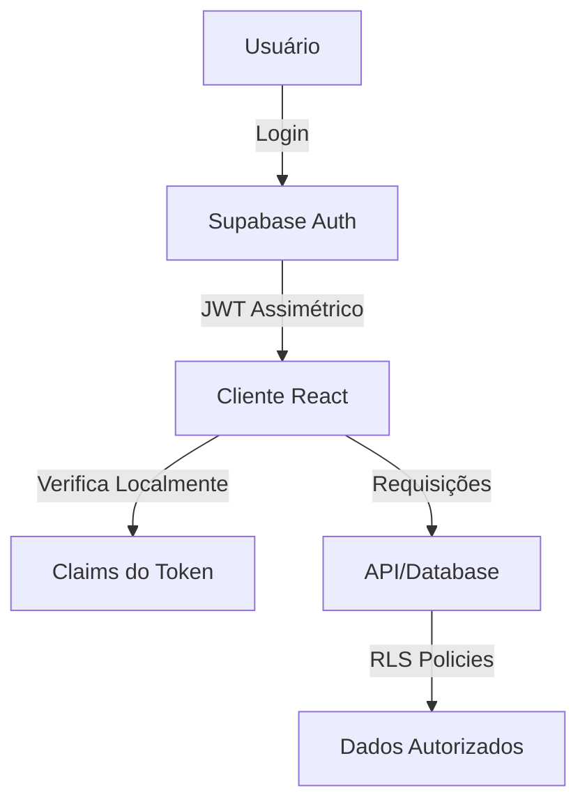

# Documentação de Autenticação - Vila Dança & Arte

## Visão Geral

Este documento consolida todo o conhecimento sobre o sistema de autenticação do Vila Dança & Arte, incluindo a migração para JWT Signing Keys assimétricos do Supabase.

## Estado Atual (05/08/2025)

### Chaves de API Atualizadas

- **Publishable Key**: `sb_publishable_B2iX94YBWwsisISGC8xNTQ_m4luaIaY`
- **Secret Key**: `sb_secret_6nK0_98iM_xGUjFrq2iEMw_wZ38bm11`

> ⚠️ **IMPORTANTE**: A secret key deve ser usada APENAS em edge functions server-side. Nunca exponha em código client-side.

### Benefícios da Migração

1. **Performance Melhorada**: Verificação local de tokens sem latência de rede
2. **Maior Segurança**: Criptografia assimétrica RSA256
3. **Rotação Sem Downtime**: Possibilidade de trocar chaves sem interrupção
4. **Padrões Modernos**: Compatível com JWKS e descoberta automática de chaves

## Arquitetura de Autenticação

### Fluxo de Autenticação



### Componentes Principais

#### 1. Hook useAuth (`src/hooks/useAuth.tsx`)
- Gerencia estado de autenticação
- Novo método `getTokenClaims()` para leitura rápida de claims
- Método `verifySession()` otimizado com verificação local
- Sincronização automática com Supabase Auth

#### 2. Cliente Supabase (`src/integrations/supabase/client.ts`)
- Configurado com nova publishable key
- Preparado para verificação assimétrica (quando disponível na lib)
- Mantém compatibilidade com sistema atual

#### 3. Utilitários JWKS (`src/utils/auth/jwks.ts`)
- Cache de chaves públicas (10 minutos)
- Descoberta automática via endpoint `.well-known/jwks.json`
- Limpeza automática de cache expirado
- Helpers para decodificação de JWT

## Otimizações Implementadas

### 1. Verificação Rápida de Sessão

```typescript
// Antes: Sempre consultava o servidor
const { data: { user } } = await supabase.auth.getUser();

// Agora: Verifica claims localmente primeiro
const claims = await getTokenClaims();
if (claims && claims.exp > Date.now() / 1000) {
  // Token válido, sem necessidade de consultar servidor
}
```

### 2. Cache de Chaves Públicas

- Cache local de 10 minutos (alinhado com Supabase Edge)
- Fallback para cache expirado em caso de erro
- Limpeza automática a cada 30 minutos

### 3. Confirmação de Email Otimizada

- Decodifica JWT para verificar `email_verified` claim
- Reduz latência na página de confirmação
- Mantém fallback para método tradicional

## Estrutura dos JWT Claims

### Claims Principais

```typescript
interface JWTClaims {
  // Claims obrigatórios
  iss: string;              // Emissor (https://project.supabase.co/auth/v1)
  aud: string | string[];   // Audiência (authenticated/anon)
  exp: number;              // Expiração (Unix timestamp)
  iat: number;              // Emitido em (Unix timestamp)
  sub: string;              // Subject (User ID)
  role: string;             // Role (authenticated/anon/service_role)
  
  // Claims de autenticação
  aal: string;              // Authenticator Assurance Level (aal1/aal2)
  session_id: string;       // ID único da sessão
  email: string;            // Email do usuário
  phone: string;            // Telefone do usuário
  email_verified?: boolean; // Email confirmado
  phone_verified?: boolean; // Telefone confirmado
  
  // Metadados
  app_metadata?: Record<string, any>;
  user_metadata?: Record<string, any>;
  amr?: Array<{             // Authentication Methods Reference
    method: string;
    timestamp: number;
  }>;
}
```

## Configuração de Segurança

### Políticas RLS (Row Level Security)

Todas as tabelas usam RLS baseado nos claims do JWT:

```sql
-- Exemplo: Política para alunos verem suas próprias matrículas
CREATE POLICY "Students can view own enrollments" 
ON enrollments 
FOR SELECT 
TO authenticated 
USING (
  student_id = (auth.jwt() ->> 'sub')::uuid
  AND (auth.jwt() ->> 'role') = 'authenticated'
);
```

### Rotação de Chaves

1. **Criar nova chave standby** no dashboard Supabase
2. **Aguardar 20 minutos** para propagação
3. **Promover para active** quando pronto
4. **Revogar chave antiga** após validação
5. **Deletar chave antiga** (opcional, após período de segurança)

## Monitoramento e Debug

### Logs Importantes

```typescript
// No console do navegador
console.log('[Auth] Token verification method:', method);
console.log('[Auth] Verification time:', endTime - startTime);
console.log('[Auth] Cache hit:', cacheHit);
console.log('[JWKS] Fetching keys from:', jwksUrl);
```

### Métricas a Acompanhar

- Taxa de erro de autenticação
- Latência de verificação de token (target: < 50ms)
- Taxa de hit do cache JWKS (target: > 90%)
- Número de renovações de token

## Troubleshooting

### Problema: Token expirado muito rápido

**Solução**: Verificar configuração de JWT expiry no dashboard (mínimo recomendado: 1 hora)

### Problema: Erro ao buscar JWKS

**Solução**: 
1. Verificar URL do projeto
2. Confirmar que endpoint está acessível
3. Cache fallback deve funcionar temporariamente

### Problema: Claims não aparecem no token

**Solução**: 
1. Verificar se está usando token de acesso (não refresh token)
2. Confirmar que usuário está autenticado
3. Verificar Custom Access Token Hook se configurado

## Próximos Passos

### Curto Prazo (1-2 semanas)
- [ ] Monitorar métricas de performance pós-deploy
- [ ] Ajustar TTL do cache se necessário
- [ ] Implementar alertas para falhas de autenticação

### Médio Prazo (1-2 meses)
- [ ] Migrar para supabase-js v3 quando disponível (suporte nativo getClaims)
- [ ] Implementar verificação criptográfica completa de JWT
- [ ] Adicionar suporte para refresh token rotation

### Longo Prazo (3-6 meses)
- [ ] Avaliar migração para auth providers externos (se necessário)
- [ ] Implementar MFA (Multi-Factor Authentication)
- [ ] Adicionar biometria para app mobile (futuro)

## Referências

- [Supabase JWT Signing Keys](https://supabase.com/blog/jwt-signing-keys)
- [JWT Claims Reference](https://supabase.com/docs/guides/auth/jwt-fields)
- [JWKS Specification](https://datatracker.ietf.org/doc/html/rfc7517)
- [Supabase Auth Docs](https://supabase.com/docs/guides/auth)

## Changelog

### 05/08/2025 - Migração Inicial
- Atualizado cliente Supabase com nova publishable key
- Implementado `getTokenClaims()` e `verifySession()`
- Criado utilitário JWKS com cache
- Otimizado confirmação de email
- Documentação completa criada

---

**Mantido por**: Equipe de Desenvolvimento Vila Dança & Arte  
**Última atualização**: 05/08/2025