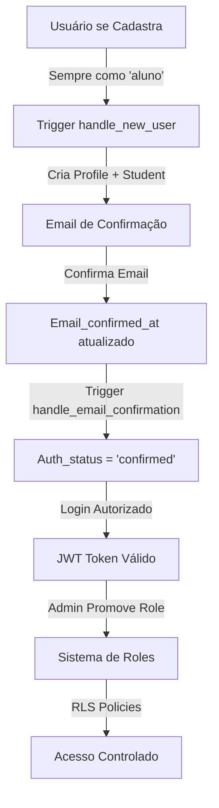

# Documentação de Autenticação - Vila Dança & Arte

## Visão Geral

Este documento consolida todo o conhecimento sobre o sistema de autenticação do Vila Dança & Arte, incluindo a migração para JWT Signing Keys assimétricos do Supabase.

## Estado Atual (06/08/2025)

### Chaves de API Atualizadas

- **Publishable Key**: `sb_publishable_B2iX94YBWwsisISGC8xNTQ_m4luaIaY`
- **Secret Key**: `sb_secret_6nK0_98iM_xGUjFrq2iEMw_wZ38bm11`

> ⚠️ **IMPORTANTE**: A secret key deve ser usada APENAS em edge functions server-side. Nunca exponha em código client-side.

### Benefícios da Migração

1. **Performance Melhorada**: Verificação local de tokens sem latência de rede
2. **Maior Segurança**: Criptografia assimétrica RSA256
3. **Rotação Sem Downtime**: Possibilidade de trocar chaves sem interrupção
4. **Padrões Modernos**: Compatível com JWKS e descoberta automática de chaves

## Arquitetura de Autenticação

### Fluxo de Autenticação Completo (Atualizado 06/08/2025)



### Novo Fluxo de Registro (06/08/2025)

1. **Registro**: Usuário sempre se cadastra como 'aluno'
2. **Trigger**: `handle_new_user()` cria registros em `profiles` e `students`
3. **Email**: Sistema envia confirmação automaticamente
4. **Bloqueio**: Acesso negado até confirmação de email
5. **Confirmação**: Trigger `handle_email_confirmation()` atualiza status
6. **Promoção**: Admin pode alterar role via interface dedicada

### Componentes Principais

#### 1. Hook useAuth (`src/hooks/useAuth.tsx`)
- Gerencia estado de autenticação
- Novo método `getTokenClaims()` para leitura rápida de claims
- Método `verifySession()` otimizado com verificação local
- Sincronização automática com Supabase Auth
- **NOVO**: Forçar cadastro sempre como 'aluno' no `signUp()`

#### 2. ProtectedRoute (`src/components/ProtectedRoute.tsx`)
- **NOVO**: Verificação obrigatória de email confirmado
- Tela dedicada para aguardar confirmação
- Botão para reenviar email de confirmação
- Bloqueio completo até confirmação

#### 3. UserRoleManager (`src/components/admin/UserRoleManager.tsx`)
- **NOVO**: Interface para promoção de roles pelo admin
- Indicadores visuais de status de confirmação de email
- Validação que impede mudança de role sem confirmação
- Tooltips e sistema de feedback

#### 4. Triggers do Banco de Dados
- **NOVO**: `handle_new_user()` - Cria profiles + students automaticamente
- **NOVO**: `handle_email_confirmation()` - Atualiza auth_status na confirmação
- Sincronização automática entre auth.users e tabelas públicas

## Otimizações Implementadas

### 1. Verificação Rápida de Sessão

```typescript
// Antes: Sempre consultava o servidor
const { data: { user } } = await supabase.auth.getUser();

// Agora: Verifica claims localmente primeiro
const claims = await getTokenClaims();
if (claims && claims.exp > Date.now() / 1000) {
  // Token válido, sem necessidade de consultar servidor
}
```

### 2. Cache de Chaves Públicas

- Cache local de 10 minutos (alinhado com Supabase Edge)
- Fallback para cache expirado em caso de erro
- Limpeza automática a cada 30 minutos

### 3. Confirmação de Email Obrigatória (NOVA IMPLEMENTAÇÃO)

- **Bloqueio Total**: Usuários não podem acessar sem confirmar email
- **Interface Dedicada**: Tela específica com instruções e reenvio
- **Triggers Automáticos**: Atualização automática de status na confirmação
- **Validação de Roles**: Promoção só permitida após confirmação

### 4. Correção do Bug Crítico dos Registros Students

- **Problema**: Usuários 'aluno' só tinham registro em profiles, não em students
- **Solução**: Trigger atualizado para criar ambos os registros
- **Migração**: Backfill automático para usuários existentes
- **Sincronização**: Dados mantidos em sincronia entre tabelas

## Estrutura dos JWT Claims

### Claims Principais

```typescript
interface JWTClaims {
  // Claims obrigatórios
  iss: string;              // Emissor (https://project.supabase.co/auth/v1)
  aud: string | string[];   // Audiência (authenticated/anon)
  exp: number;              // Expiração (Unix timestamp)
  iat: number;              // Emitido em (Unix timestamp)
  sub: string;              // Subject (User ID)
  role: string;             // Role (authenticated/anon/service_role)
  
  // Claims de autenticação
  aal: string;              // Authenticator Assurance Level (aal1/aal2)
  session_id: string;       // ID único da sessão
  email: string;            // Email do usuário
  phone: string;            // Telefone do usuário
  email_verified?: boolean; // Email confirmado
  phone_verified?: boolean; // Telefone confirmado
  
  // Metadados
  app_metadata?: Record<string, any>;
  user_metadata?: Record<string, any>;
  amr?: Array<{             // Authentication Methods Reference
    method: string;
    timestamp: number;
  }>;
}
```

## Configuração de Segurança

### Políticas RLS (Row Level Security) - ATUALIZADAS 06/08/2025

Sistema de segurança baseado em confirmação de email e roles:

```sql
-- Usuários podem ver seu próprio perfil
CREATE POLICY "Users can view own profile"
ON public.profiles FOR SELECT TO authenticated
USING (auth.uid() = id);

-- Admin e funcionário podem ver todos os perfis
CREATE POLICY "Admin and staff can view all profiles"
ON public.profiles FOR SELECT TO authenticated
USING (
  EXISTS (
    SELECT 1 FROM public.profiles
    WHERE id = auth.uid() AND role IN ('admin', 'funcionario')
  )
);

-- Estudantes podem ver apenas seus próprios registros
CREATE POLICY "Students can view own record"
ON public.students FOR SELECT TO authenticated
USING (auth.uid() = id);
```

### Funções Auxiliares de Segurança

```sql
-- Verificar role do usuário
CREATE FUNCTION public.check_user_role(required_roles text[])
RETURNS boolean AS $$
BEGIN
  RETURN EXISTS (
    SELECT 1 FROM public.profiles
    WHERE id = auth.uid() AND role = ANY(required_roles)
  );
END;
$$ LANGUAGE plpgsql SECURITY DEFINER;

-- Verificar se email foi confirmado
CREATE FUNCTION public.is_email_confirmed()
RETURNS boolean AS $$
BEGIN
  RETURN EXISTS (
    SELECT 1 FROM auth.users
    WHERE id = auth.uid() AND email_confirmed_at IS NOT NULL
  );
END;
$$ LANGUAGE plpgsql SECURITY DEFINER;
```

### Rotação de Chaves

1. **Criar nova chave standby** no dashboard Supabase
2. **Aguardar 20 minutos** para propagação
3. **Promover para active** quando pronto
4. **Revogar chave antiga** após validação
5. **Deletar chave antiga** (opcional, após período de segurança)

## Monitoramento e Debug

### Logs Importantes

```typescript
// No console do navegador
console.log('[Auth] Token verification method:', method);
console.log('[Auth] Verification time:', endTime - startTime);
console.log('[Auth] Cache hit:', cacheHit);
console.log('[JWKS] Fetching keys from:', jwksUrl);
```

### Métricas a Acompanhar

- Taxa de erro de autenticação
- Latência de verificação de token (target: < 50ms)
- Taxa de hit do cache JWKS (target: > 90%)
- Número de renovações de token

## Troubleshooting

### Problema: Token expirado muito rápido

**Solução**: Verificar configuração de JWT expiry no dashboard (mínimo recomendado: 1 hora)

### Problema: Erro ao buscar JWKS

**Solução**: 
1. Verificar URL do projeto
2. Confirmar que endpoint está acessível
3. Cache fallback deve funcionar temporariamente

### Problema: Claims não aparecem no token

**Solução**: 
1. Verificar se está usando token de acesso (não refresh token)
2. Confirmar que usuário está autenticado
3. Verificar Custom Access Token Hook se configurado

### 🚨 NOVOS PROBLEMAS RESOLVIDOS (06/08/2025)

#### Problema: Usuários alunos sem registro na tabela students

**Solução Implementada**:
- Trigger `handle_new_user()` corrigido para criar ambos os registros
- Migration de backfill para usuários existentes
- Sincronização automática entre tabelas

#### Problema: Usuários acessando sem confirmar email

**Solução Implementada**:
- `ProtectedRoute` atualizado com verificação obrigatória
- Interface dedicada para aguardar confirmação
- Bloqueio total até confirmação de email

#### Problema: Admin não conseguia alterar roles de usuários

**Solução Implementada**:
- Interface `/admin/user-roles` criada
- Sistema de validação de email confirmado
- Indicadores visuais de status de confirmação

## Próximos Passos

### Curto Prazo (1-2 semanas) - ATUALIZADO
- [x] **CONCLUÍDO**: Sistema de confirmação de email obrigatória
- [x] **CONCLUÍDO**: Interface de gerenciamento de roles pelo admin
- [x] **CONCLUÍDO**: Correção do bug crítico de registros students
- [ ] Monitorar métricas de performance pós-deploy
- [ ] Implementar alertas para falhas de autenticação

### Médio Prazo (1-2 meses)
- [ ] Migrar para supabase-js v3 quando disponível (suporte nativo getClaims)
- [ ] Implementar verificação criptográfica completa de JWT
- [ ] Adicionar suporte para refresh token rotation
- [ ] **NOVO**: Implementar sistema de convites para professores/funcionários

### Longo Prazo (3-6 meses)
- [ ] Avaliar migração para auth providers externos (se necessário)
- [ ] Implementar MFA (Multi-Factor Authentication)
- [ ] Adicionar biometria para app mobile (futuro)
- [ ] **NOVO**: Dashboard de analytics de autenticação

## Referências

- [Supabase JWT Signing Keys](https://supabase.com/blog/jwt-signing-keys)
- [JWT Claims Reference](https://supabase.com/docs/guides/auth/jwt-fields)
- [JWKS Specification](https://datatracker.ietf.org/doc/html/rfc7517)
- [Supabase Auth Docs](https://supabase.com/docs/guides/auth)

## Changelog

### 06/08/2025 - Reforma Completa do Sistema de Autenticação
- **CRÍTICO**: Corrigido bug de usuários alunos sem registro na tabela students
- **NOVO**: Confirmação de email obrigatória para todos os usuários
- **NOVO**: Sistema de promoção de roles pelo admin (`/admin/user-roles`)
- **NOVO**: Interface dedicada para aguardar confirmação de email
- **NOVO**: Triggers automáticos `handle_new_user()` e `handle_email_confirmation()`
- **NOVO**: Políticas RLS atualizadas com funções auxiliares de segurança
- **MELHORIA**: Formulário de cadastro sempre registra como 'aluno'
- **MELHORIA**: Sistema de indicadores visuais para status de confirmação
- **MELHORIA**: Validações que impedem alterações sem confirmação de email
- **MIGRAÇÃO**: Backfill automático para usuários existentes sem registro students

### 05/08/2025 - Migração Inicial
- Atualizado cliente Supabase com nova publishable key
- Implementado `getTokenClaims()` e `verifySession()`
- Criado utilitário JWKS com cache
- Otimizado confirmação de email
- Documentação completa criada

---

**Mantido por**: Equipe de Desenvolvimento Vila Dança & Arte  
**Última atualização**: 06/08/2025